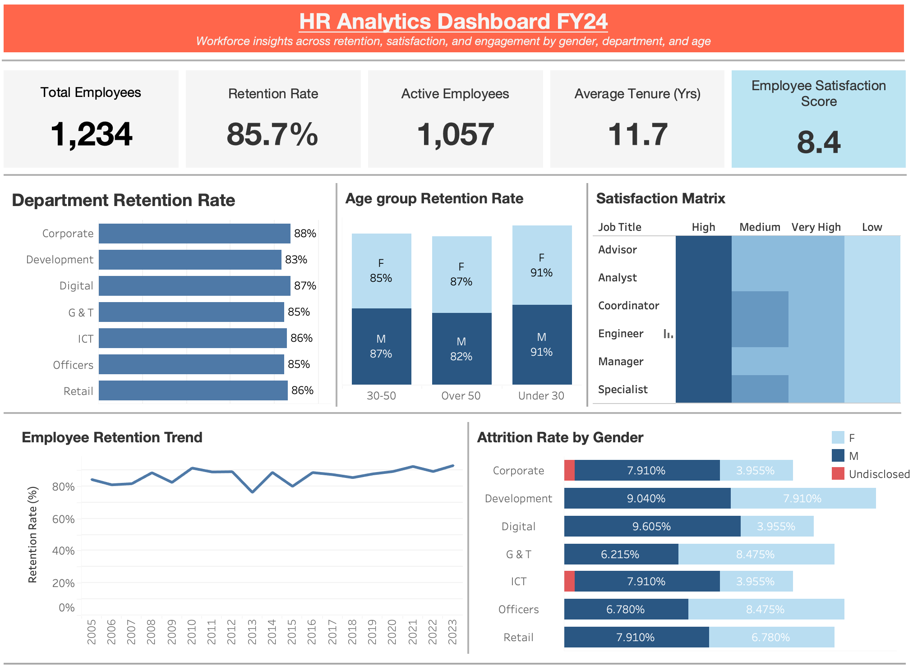
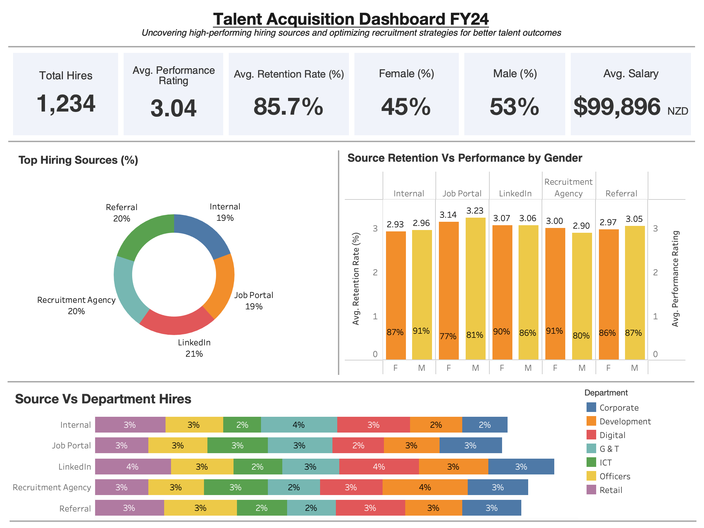
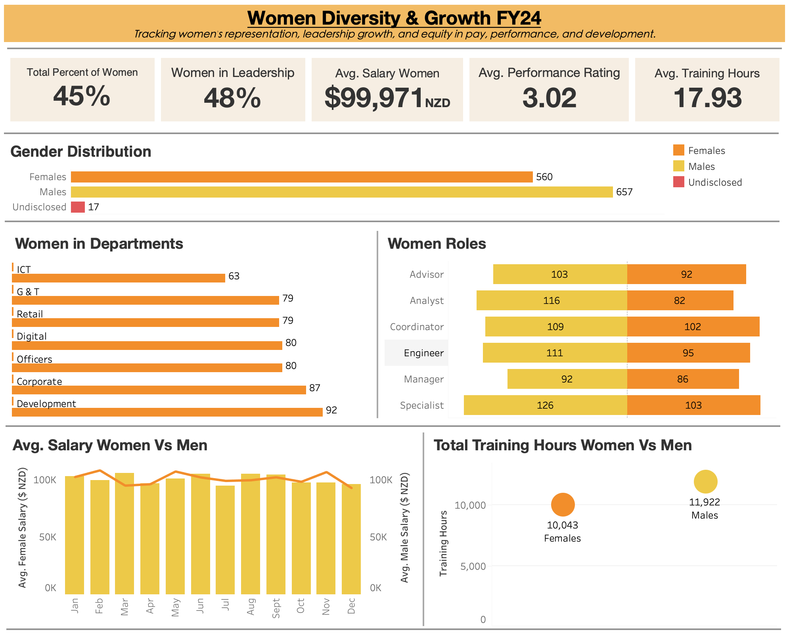
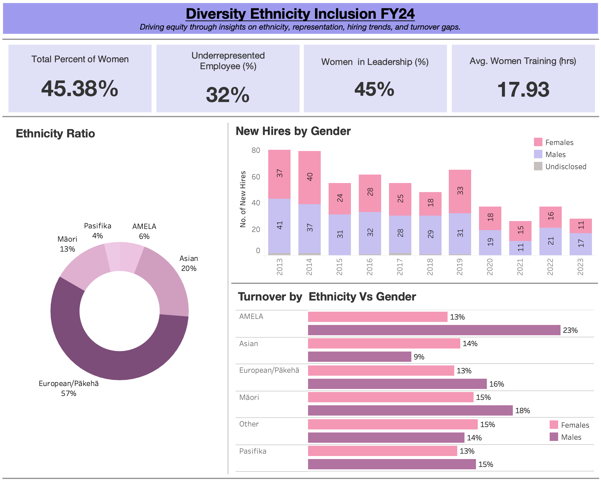
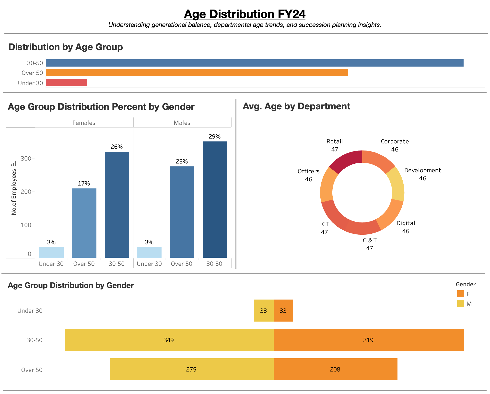

# 📊 HR Analytics Dashboards for Contact Energy – FY24

## 👋 Overview

This project showcases an end-to-end **HR analytics solution** developed in **Tableau** for **Contact Energy New Zealand**, aligning with the organisation’s commitment to **sustainability, people-first strategy, and DEI (diversity, equity, and inclusion)**.

Through **5 dynamic and interactive dashboards**, the analysis dives deep into strategic workforce metrics to support smarter, data-driven decisions across **talent, retention, DEI, and employee wellbeing**.

---

## 📌 Dashboards Included

### 1️⃣ HR Analytics Scorecard
*A high-level snapshot of key workforce metrics for leadership review.*

- **Total Employees:** 1,234  
- **Retention Rate:** 85.7%  
- **Average Tenure:** 11.7 years  
- **Employee Satisfaction Score:** 8.4/10  
- **Drilldowns by:** department, gender, age group

---

### 2️⃣ Talent Acquisition Dashboard
*Evaluates hiring source performance and recruitment ROI.*

- **Top Sources:** LinkedIn (21%), Referral (20%)
- **Key Insight:** Internal hires have best performance & retention
- **Departmental View:** Source vs hiring department breakdown

---

### 3️⃣ Women Diversity & Growth
*Analyzes female representation across roles, departments, and leadership.*

- **Women in Workforce:** 45.38%  
- **Women in Leadership:** 47.5%  
- **Avg. Salary (Women):** $99,971 NZD  
- **Avg. Training Hours (Women):** 10,043 vs **Men:** 11,922  
- **Visuals:** Gender breakdown by role & salary trend comparison

---

### 4️⃣ DEI (Diversity, Equity & Inclusion) Dashboard
*Highlights ethnic diversity, turnover and hiring patterns across demographics.*

- **Underrepresented Employees:** 32%  
- **Ethnic Breakdown:** Māori, Pasifika, Asian, AMELA, European  
- **Turnover Hotspot:** AMELA Female turnover at 23%  
- **New Hires:** Tracked over 10 years by gender

---

### 5️⃣ Age Distribution Dashboard
*Workforce segmentation by age and department.*

- **Largest Age Group:** 30–50 (56%)  
- **High Retention:** 91% for under-30s  
- **Avg. Age Across Departments:** 46–47  
- **Visuals:** Age pyramid, gender split, departmental averages

---

## 🧠 Tools & Technologies

- [x] **Tableau** – Interactive visual dashboards  
- [x] **Excel/CSV** – Data prep & mock dataset  
- [x] **GitHub** – Portfolio version control  
- [x] **Storytelling** – Strategic HR insight design

---

## 🎯 Key Outcomes

- Aligned dashboards with Contact’s strategic HR themes  
- Created executive-ready visuals for decision-making  
- Demonstrated KPIs in DEI, retention, hiring, and capability building  
- Helped identify actionable insights and performance gaps

---

## 🖼️ Dashboard Link

[Click here](https://public.tableau.com/views/EnergyCompanyHRDashboard/Dashboard-1-Retention?:language=en-GB&:sid=&:redirect=auth&:display_count=n&:origin=viz_share_link)

---

## 🙌 Team & Contribution

Built as part of a group project during the **Master of Business Analytics** program.

- 🔍 **Focus:** Real-world HR storytelling through analytics  
- 💼 **Organisation:** Inspired by Contact Energy NZ’s ESG & annual reports  
- 💬 **Role:** Dashboard development, insights extraction, presentation strategy

---

## ⚠️ Disclaimer

The dataset used is **synthetic/mock data**, designed to reflect proportions and patterns publicly shared by Contact Energy NZ. This project is strictly for **educational and portfolio** purposes.

---

## 🔗 Let’s Connect

If you found this project insightful:
- ⭐ Star the repo
- 🧑‍💻 [Connect on LinkedIn](https://linkedin.com/in/your-profile)
- 📧 Reach out for collaboration or freelance analytics projects

